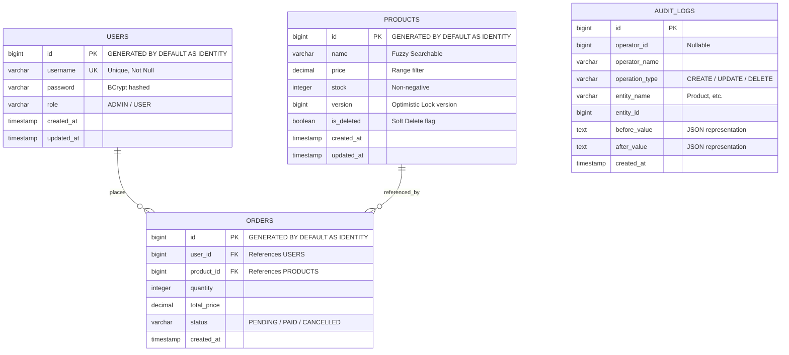

# 設計文件 - 商品交易平台後端服務

本文件說明商品交易平台的系統架構、資料庫設計、技術取捨（Trade-offs）以及高流量下的擴展方案。

---

## 1. 架構說明

本專案採用經典的**分層架構（Layered Architecture）**，並依據職責進行模組化劃分，結構如下：

- **`config/`**：包含安全設定（Spring Security）、OpenAPI 規範、Rate Limiting 核心 Filter 等。
- **`controller/`**：負責接收 RESTful 請求、參數校驗（使用 JSR-380 `@Valid`），並封裝 API 回傳結果。
- **`dto/`**：數據傳輸對象（Data Transfer Object），用於將資料庫實體（Entity）與客戶端 API 進行隔離，避免敏感欄位外洩。
- **`entity/`**：資料庫對應實體（JPA Entities）。
- **`repository/`**：數據存取層，繼承 `JpaRepository` 以取得基礎的 CRUD 能力。
- **`service/`**：核心業務邏輯層。在此層定義交易邊界（`@Transactional`），並處理資料一致性與重試邏輯。
- **`security/`**：JWT 機制的核心元件（Token 生成、解析、過濾器與使用者載入）。

### 為什麼這樣設計？
1. **單一職責原則 (SRP)**：控制層只管 API 入口與輸出，服務層專注於商務邏輯，數據層只管資料庫存取。
2. **安全性與擴充性**：透過 DTO 將 Entity 隔離，使得未來欄位修改時，只需修改對應的 Mapper，而不會直接破壞 API 規格。
3. **無狀態架構 (Stateless)**：採用 JWT Token 做身分驗證，便於未來水平擴展（Scale-out）至多個 Application 節點。

### 考慮過的替代方案
- **六角架構 (Hexagonal Architecture / Ports and Adapters)**：這是一種更為解耦的架構，將領域邏輯放在最內層。然而，對於此商品平台專案的規模，六角架構會引入大量的 interface 與轉換器，增加不必要的工程複雜度，故最終選擇實用且直觀的分層架構。

---

## 2. 資料庫設計

我們採用 PostgreSQL 作為關聯式資料庫，並使用 Flyway 進行版本管理（Migration）。

### ER Diagram

### 建立的索引（Index）與設計理由
1. **`products(name)`** (B-Tree)：用於商品的模糊搜尋（`name LIKE %...%`）。當商品量達到百萬級時，一般的 B-Tree 配合 `LIKE` 前置萬用字元（如 `%abc%`）無法使用索引。
   - *優化方案*：若面臨百萬級模糊搜尋，我們會改用 PostgreSQL 的 **`pg_trgm`（三元組）** 擴充功能，並建立 **GIN 索引**。
2. **`products(price)`** (B-Tree)：用於價格區間篩選（`price >= min AND price <= max`），可大幅加速範圍查詢。
3. **`products(is_deleted)`** (B-Tree)：商品列表中只會呈現未刪除商品，透過此索引快速排除已邏輯刪除的資料。
4. **`orders(user_id)`** (B-Tree)：便於快速查詢個別使用者的訂單歷史記錄。
5. **`audit_logs(entity_name, entity_id)`** (Composite Index)：審計日誌最常以「查詢某一商品的歷史變更」為依據，使用複合索引能極速定位該商品的歷次變更。

---

## 3. 取捨（Trade-offs）與深度思考

### A. 庫存控制：樂觀鎖 (Optimistic) vs 悲觀鎖 (Pessimistic)
- **決定**：採用 JPA `@Version` **樂觀鎖**，並輔以 **自訂事務重試機制（3 次重試）**。
- **理由**：
  - 悲觀鎖（`SELECT FOR UPDATE`）會佔用資料庫連線並鎖定整行資料，直到事務提交為止。在高併發下，會造成嚴重的線程阻塞與死鎖風險。
  - 樂觀鎖利用版本號比對，在寫入時才驗證衝突，對資料庫的資源占用極短。在高併發衝突時，雖然會丟出異常，但我們在服務層設計了 `placeOrder` 重試機制（利用 `@Transactional(propagation = Propagation.REQUIRES_NEW)` 新建事務進行重試），能夠在使用者無感的情況下處理輕度到中度的併發衝突。

### B. 刪除策略：軟刪除 (Soft Delete) vs 實體刪除 (Hard Delete)
- **決定**：採用 **邏輯刪除（`is_deleted = true`）**。
- **理由**：
  - 實體刪除商品會破壞歷史訂單的外鍵關聯（Referential Integrity），或導致歷史訂單資料失真。
  - **避開的 JPA 陷阱**：許多開發者會使用 Hibernate 的 `@Where(clause = "is_deleted = false")` 自動過濾已刪除資料。但這會導致查詢歷史訂單時，因無法加載已刪除商品而拋出 `EntityNotFoundException`。因此，我們**不使用 `@Where`**，而是在 Repository 顯式設計 `findByIsDeletedFalse` 進行一般瀏覽，並保留透過 ID 取得已刪除商品的能力。

### C. 限流機制：Token Bucket 演算法
- **決定**：在 Servlet Filter 中透過 Concurrent Map 實作 Token Bucket（權杖桶）演算法。
- **理由**：相較於固定窗口（Fixed Window）會產生的邊界突增流量，權杖桶能更平滑地限制流量，並允許適度的突發流量（Burstiness）。在單機下，不需要依賴 Redis 即可完成高效的併發限制。

---

## 4. 流量增加 100 倍時的擴展與優化方案（Scale-out）

如果流量與數據量增加 100 倍（進入百萬級商品與高頻交易），系統瓶頸與改善步驟如下：

| 瓶頸點 | 問題說明 | 優化與解決方案 |
| :--- | :--- | :--- |
| **資料庫庫存鎖定** | 樂觀鎖衝突率會大幅上升，導致大量重試失敗。 | **1. 記憶體庫存扣減**：改用 Redis 的 `DECR` / `DECRBY` 指令在記憶體進行庫存扣減。Redis 是單線程的，能保證絕對不會超賣，且 TPS 可達 10 萬級。 **2. 非同步下單**：利用 Message Queue（如 Kafka 或 RabbitMQ）將下單請求非同步化。用戶下單後先回傳「處理中」，由背景 Consumer 依序處理扣減庫存與生成訂單。 |
| **限流效能與分散式環境** | 當前實作為單機 JVM 記憶體限制，無法跨節點共享。 | **1. 分散式限流**：改用 **Redis + Lua 腳本** 實作分散式 Token Bucket。 **2. Gateway 限流**：將限流邏輯前移至 API Gateway（如 Spring Cloud Gateway 或 Nginx），保護後端應用伺服器不被擊垮。 |
| **商品搜尋效能** | 百萬級商品的名模糊搜尋在 PostgreSQL 中效能會急遽下降。 | **1. 搜尋引擎**：將商品搜尋遷移至專用的搜尋引擎如 **Elasticsearch**，並透過 Logstash / Debezium 進行資料庫變更同步。 **2. 快取層**：使用 Redis 快取熱門商品詳情與第一頁的搜尋結果。 |
| **Audit Log 寫入IO限制** | 頻繁的商品更新會使寫入 `audit_logs` 成為資料庫 IOPS 瓶頸。 | **1. 非同步審計**：透過 Spring Event 或 MQ 將審計日誌改為非同步寫入。 **2. 讀寫分離與日誌庫**：將 Audit Log 獨立儲存於 NoSQL（如 Elasticsearch 或 MongoDB），以應對寫多讀少的場景，並避免影響核心交易資料庫。 |

---

## 5. AI 使用聲明

本專案借助 AI 工具（Gemini）協助：
1. **Spring Initializr 骨架生成**：加速專案環境依賴的配置。
2. **重複性程式碼（DTO & Boilerplate）**：快速生成對應的欄位與 Builder。

### 驗證 AI 產出正確性的方式
- **單元測試與集成測試**：特別撰寫了 `OrderServiceConcurrencyTest` 進行 15 個線程併發搶購的集成測試，藉此驗證樂觀鎖在真實併發環境下是否能防止超賣（避免庫存為負值），並確保重試邏輯在多個資料庫事務中能正常提交與回滾。
- **編譯與啟動驗證**：在主機編譯並執行全量 JUnit 5 測試套件，確認所有的 Spring 安全過濾鏈、JPA 版本更新、Flyway 遷移皆無報錯。
